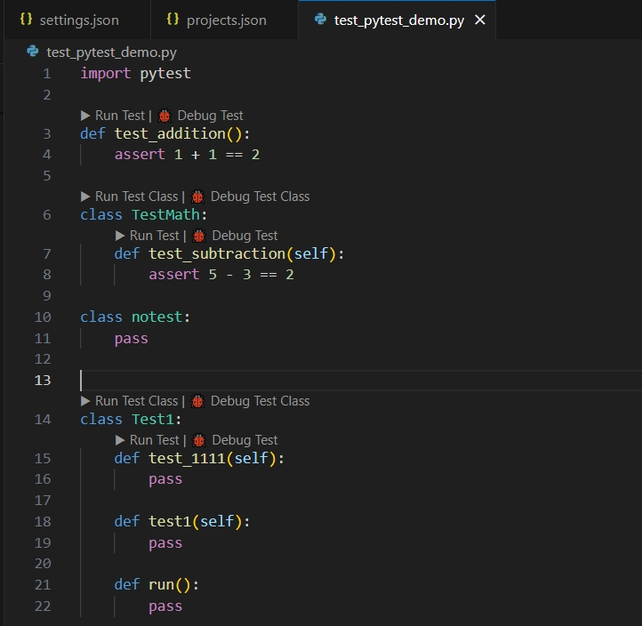
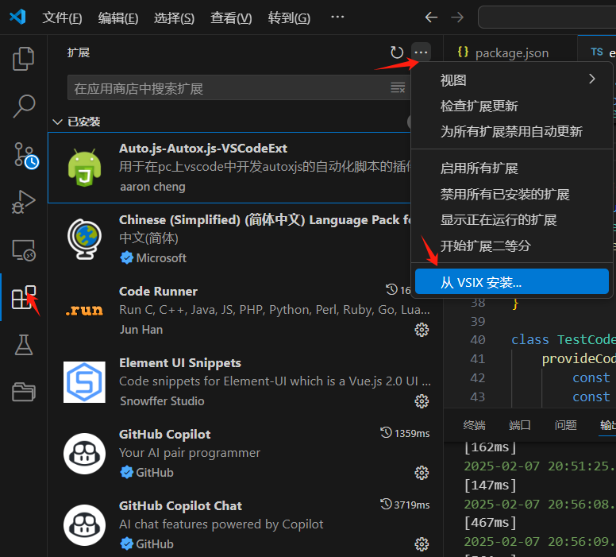

# Pytest Runner for VS Code

## 🚀 简介

**Pytest Runner** 是一款专为 VS Code 设计的插件，旨在优化 `Python Test Explorer for Visual Studio Code` 的一些不足之处。该插件支持更快的测试扫描、更灵活的调试配置，并显著提升测试运行速度，解决了 **测试发现失败、运行缓慢、无法轻松调试** 等问题。

## 🎯 主要功能

- 🔍 **快速测试发现**：避免 `Python Test Explorer` 过于缓慢的文件扫描
- ▶ **一键运行测试**：提供 `Run Test` 和 `Run Test Class` 按钮
- 🐞 **支持测试调试**：提供 `Debug Test` 和 `Debug Test Class`，方便断点调试
- ⚡ **高效测试执行**：优化 pytest 运行方式，提升执行速度
- 🎛 **可自定义配置**：支持 `pytestRunner.alluredir` ，pytestRunner.args 等参数，适配不同需求

⚠️ ：该扩展适用于vscode 1.80.0或之后的版本，只能在**Linux**上运行，如需在windows上运行，修改代码即可



## 📦 安装

1. 在 VS Code **扩展商店** 搜索 `Pytest Runner` 并安装

2. 下载已打包好的vsix文件进行安装

   

3. 或者使用如下命令安装插件：

```js
code --install-extension /xxx/your.vsix(你本地的插件路径)
```

## 🛠️ 配置

你可以在 VS Code **设置 (`settings.json`)** 中自定义插件行为，例如：

```json
{
    "pytestRunner.pytestArgs": "-v --setup-show", // pytest命令行参数
    "pytestRunner.allureDir": "report_v3",
    "pytestRunner.pythonCmd": "sudo python3.7", // 读取运行时对于python的设定，例如python3.8，python3.7，python，sudo python3
}
```

## 🚀 使用方法

### **1️⃣ 运行单个测试**

在 `test_*.py` 文件的测试函数上方，会自动生成 **Run Test / Debug Test** 按钮。

- **Run Test**：点击后立即执行 `pytest`
- **Debug Test**：点击后在 VS Code 内部启动调试器

### **2️⃣ 运行整个测试类**

对于 `class TestXxx` 形式的测试类，也会生成 **Run Test Class / Debug Test Class** 按钮。

- **Run Test Class**：运行该类内所有测试
- **Debug Test Class**：调试该类的所有测试

### **3️⃣ 终端命令行手动执行**

如果你想手动执行测试，可以在 VS Code 终端运行：

```sh
pytest -v test_example.py::test_case_name
```

## 💡 常见问题

### 1. **插件未生效？**

确保你已经在 VS Code 内 **启用了 Python 扩展** 并正确安装了 `pytest`。

### 2. **无法找到测试？**

确保你的测试文件名是 `test_*.py`，并且测试函数以 `def test_` 开头。

### 3. **如何提高测试运行速度？**

可以尝试：

- 禁用 pytest 自动发现：

  ```json
  {
      "python.testing.pytestEnabled": false
  }
  ```

- 配置 pytest 只扫描指定目录：

  ```sh
  pytest --tb=short --disable-warnings
  ```

## 🎉 贡献 & 反馈

如果你有更好的想法或发现了问题，欢迎提交 Issue 或 PR！

